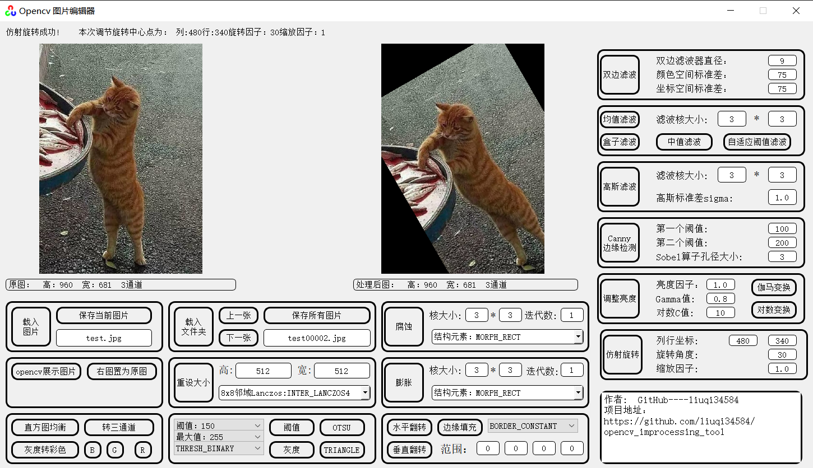
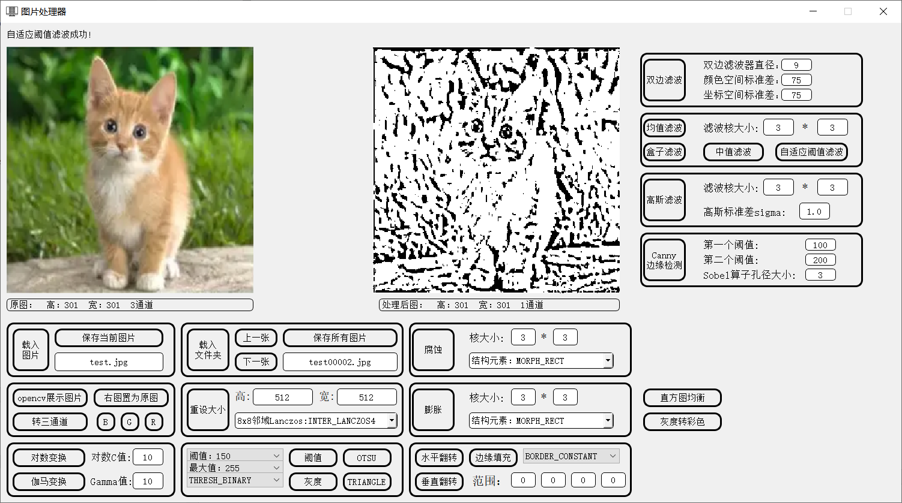
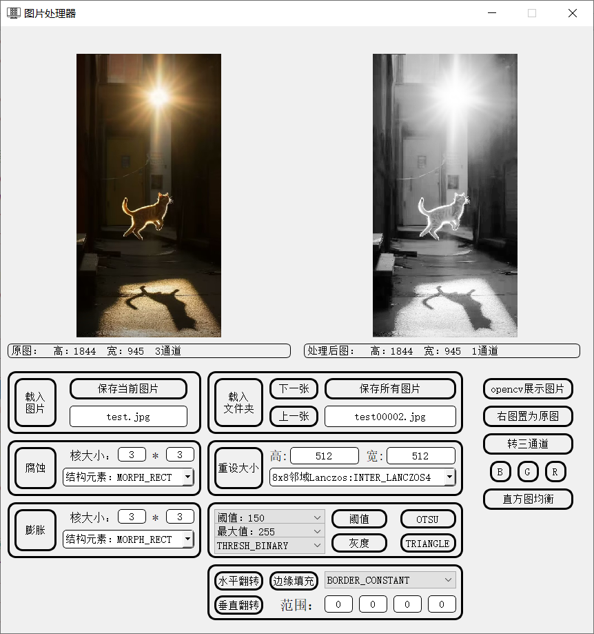
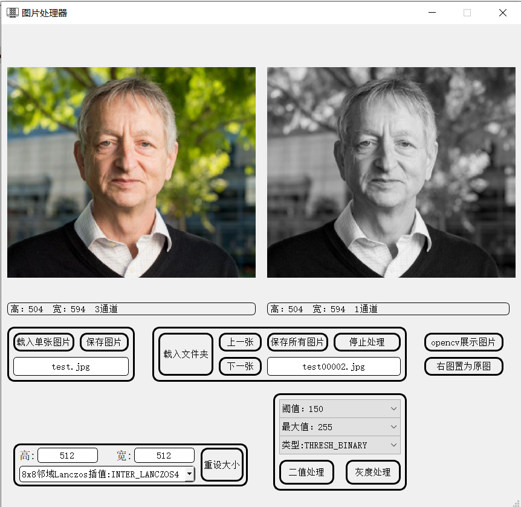

# 图片工具
本工程基于Qt开发，其软件用于日常对图片的处理，避免麻烦的代码处理过程。

## 开发环境

windows 10 (64 bit)

QT Creator 4.12

Opencv-4.6.0（使用cmake-3.26.0编译）

## 工程介绍

imageshow 是源代码文件

output 是编译结果，其中的 Image_show.exe 已经做了跨设备适配，下载到本地直接运行。

功能随时更新，需要什么加什么。
## v2.4
添加了仿射旋转函数，添加了软件标签
调整了部分标签位置适应不通分辨率电脑
<left><left>

## v2.3
解决图标不显示的BUG
为膨胀，腐蚀功能添加了迭代器参数

## v2.2
增加了对数变换，gamma变换

均值滤波，盒子滤波，高斯滤波，中值滤波，双边滤波，自适应阈值滤波

canny边缘检测器

界面如图：

<left><left>

## v2.1
增加了膨胀，腐蚀模块

增加了单通道提取模块

增加了直方图均衡模块

增加了翻转，填充模块

界面如图：

<left><left>

## v2.0 

充分运用 C++ 类，结构体，对象等知识。

极大的改善了代码结构，工程结构。

界面如图：

<left><left>

## v1.0

二值以及灰度处理（包括各种阈值设置，阈值参数等）

图片resize大小（包括利用最邻近插值法，双线性插值，4方，8方插值值，像素关系重采样）

